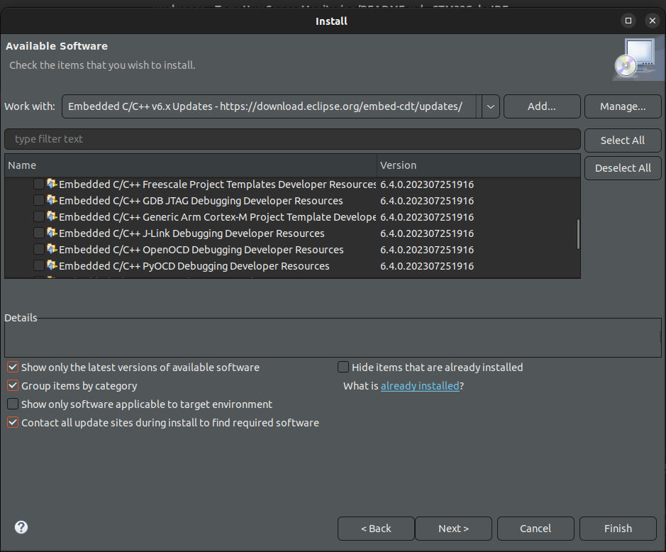
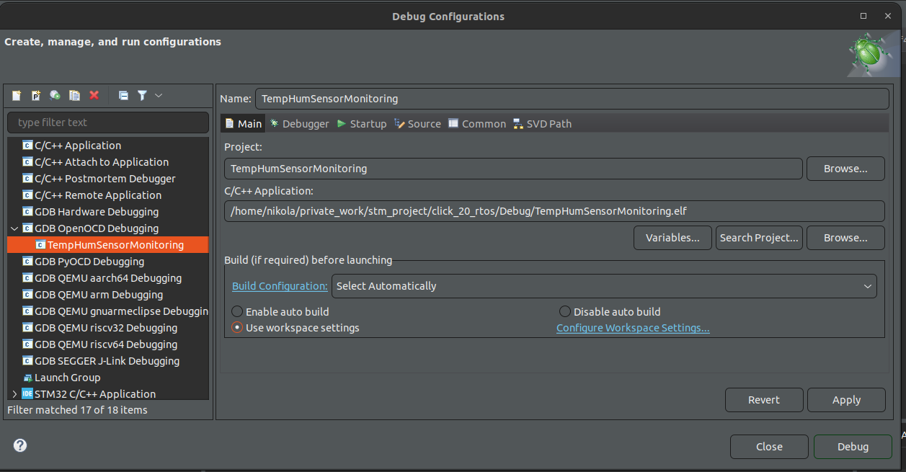
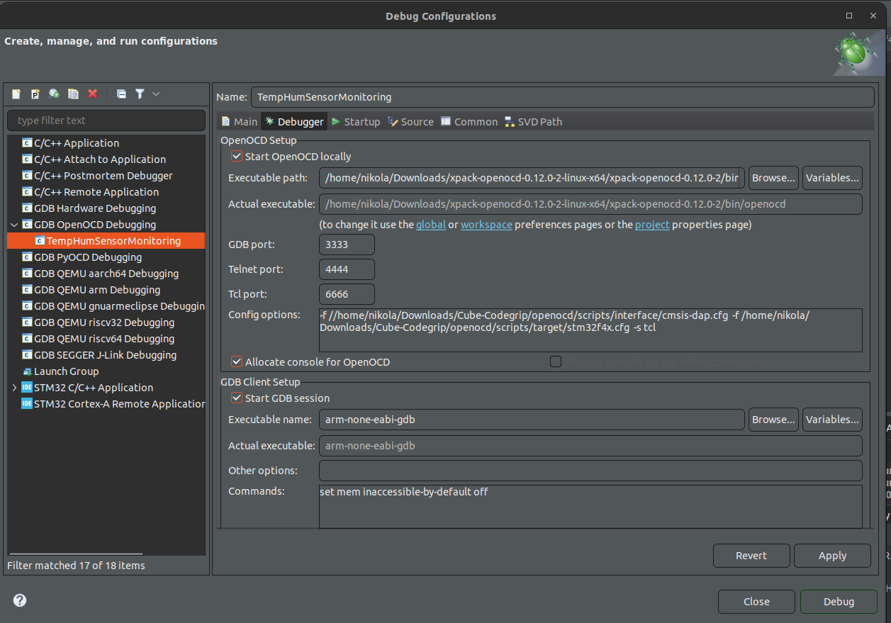
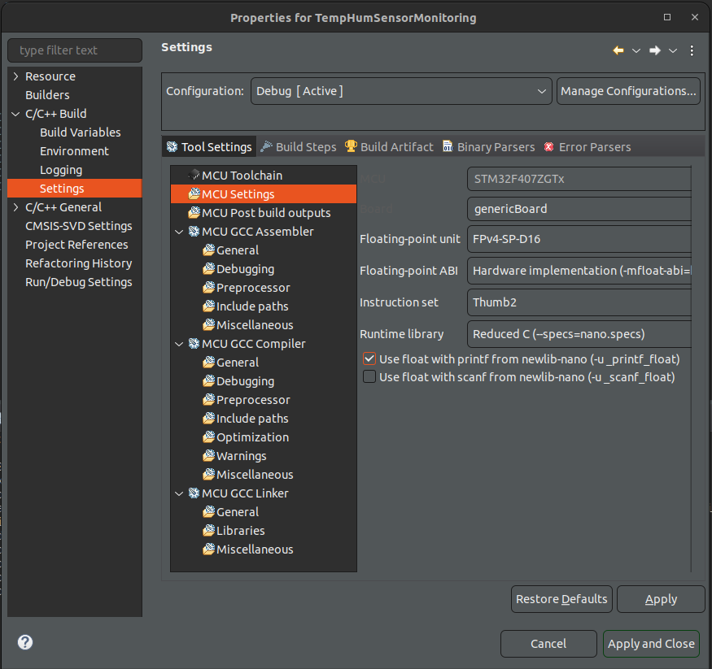
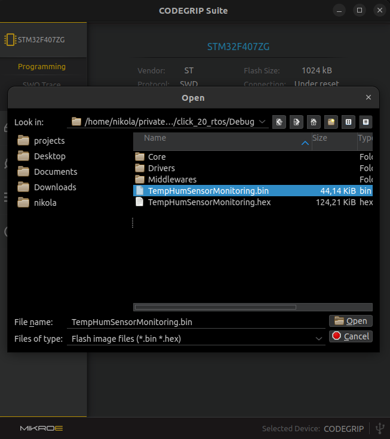
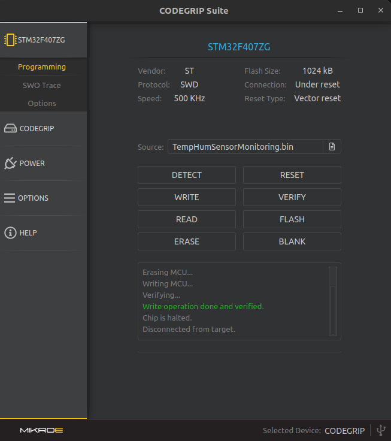
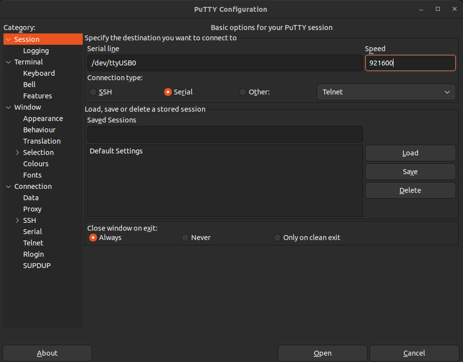
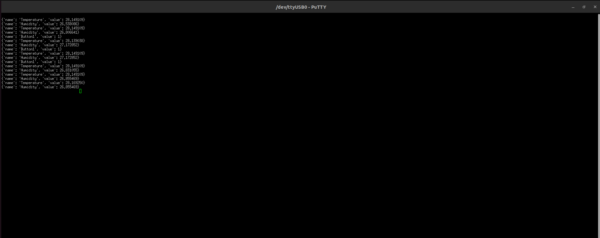

# click_20_rtos

## Description
### This project showcase how FREE RTOS can be used for 
### MirkoE development borad Sensor Fusion for ARMv8

# Project setup
## Setup Sensor fusion for armv8 dev board
* Move pull up on port A swicth SW3
* Connect POWER/DEBUG port to the laptop for downloading and debug firmware purpose
* Conect USB-UART to the laptop
* PA5 button is used as user button

## Cube IDE
### Import project
* Go to File->Import->General->Existing Projects into Workspace
* Navigate to the folder where project reside
* Configuring OpenOCD debugger:
    - Install GNU ARM C/C++ OpenOCD Debugging plugin:  
    
    - Right click on project and go Debug As -> Debug Configurations -> GDB Open OCD Debugging:  
    
    - Setup debug configuration:  
    
* Configure printf with floating point numbers:
    - Right click on the project and go to Properties -> C/C++ Build -> Settings -> MCU settings 
    - Check 'Use float with printf from (-u_printf_float)':  
    

## Download firmware

### CODEGRIP
* Open CODEGRIP
* Navigate to .bin file in Debug or Release folder:   
    
* Press write command:   
    

## Logging messages
### Logging messages are expressed in json format. Logging structure has 2 fields `name` and `value`.
### In order to see messages on host PC, it needs to setup serial port
### Steps to setup serial port on Putty:
* Open putty and setup baud rate to 921600 and pick right serial port (in this case it is /dev/ttyUSB0):   
    
* Terminal output should look:   
    

